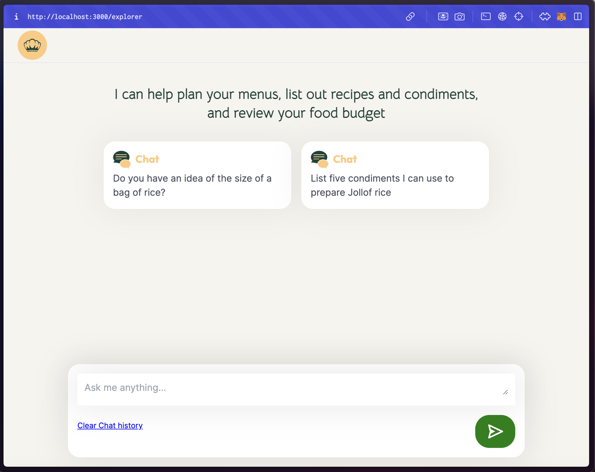

# The Highfeast Explorer

`- HF Explorer is in active development and not fully ready for public testing. This README is a public guide for developers and contributors who would like to join or contribute to our team. Namaste! 🙇`

Problem Statement:
Many individuals lack specialized assistance when planning menus for events or estimating food quantities and costs. Especially the local food!

## Shots:

## Short Description:

Highfeast Explorer is an AI powered food companion and catering assistant.

## Vision:

To provide users with an intuitive platform where they can easily plan menus, estimate costs, and receive cooking assistance, leveraging a decentralized internet for storage, and similarity checks from vectorized datasets curated from over 23 years of Highfeast's traditional catering services.

## Description and Outline:

Highfeast Explorer is designed to cater to users' diverse food-related events, whether they are planning a wedding, organizing a community feeding program, or managing home cooking. 

We use vectorized food datasets to gain context-specific insights and offer personalized recommendations and responses to prompts.

## Features:

- Specialized food companion and catering assistant
- Intuitive platform for planning menus and estimating food costs
- Access to specialized datasets from highfeast and cookbook creators.
- Secure AI chat history and data storage with internet computer's Juno framework

## Technologies Used:

- Client: Next.js, Tailwind
- Vector Database: Pinecode
- Authentication and History Storage: Juno (ICP Framework)
- LLM: OpenAI GPT-3.5
- Other Framwworks: Langchain

## Installation:

1. Clone the repository: `git clone  https://github.com/highfeast/explorer`
2. Navigate to the project directory: `cd explorer`
3. Install dependencies: `npm install`
4. Create a .env file and enter openAI and pinecone Keys

## Usage:

1. Start the frontend development server: `npm run dev`
2. Access the application in your browser: `http://localhost:3000/explorer`
3. Sign up and start a conversation

### Contributors:

- [Highfeast Catering Services](https://www.instagram.com/highfeast_ng): Moko datasets on African food menus 
- [@dezy404](): Product lead
- [@AcGodson](): Developer lead
- [@KelvinPraises](): Frontend design
- [@BlossomMd](): Brand and Assets Design

